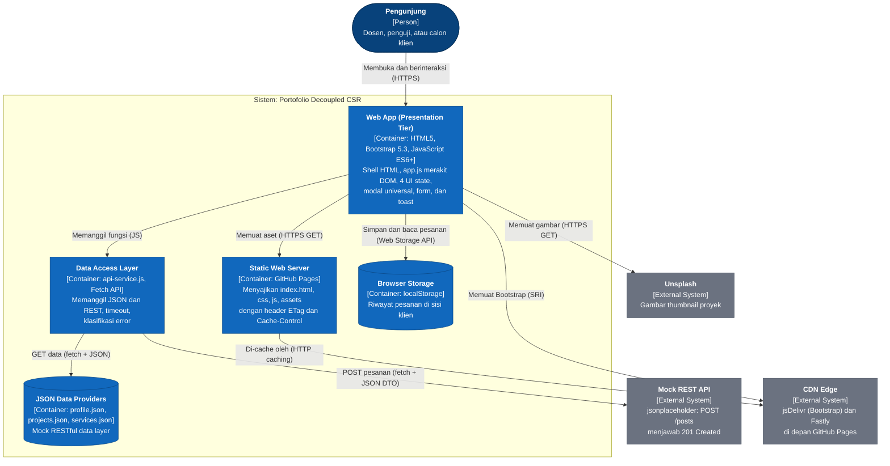
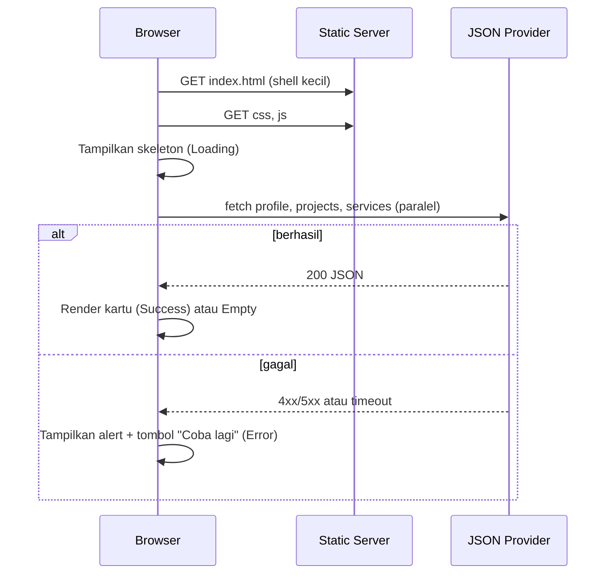
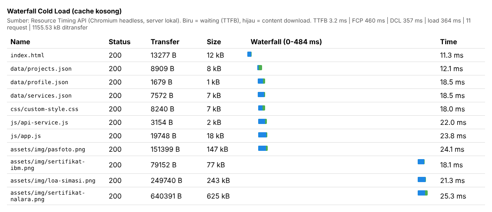
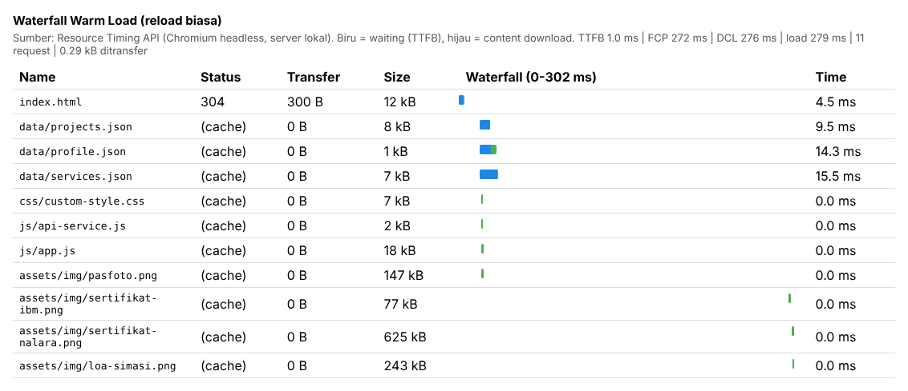
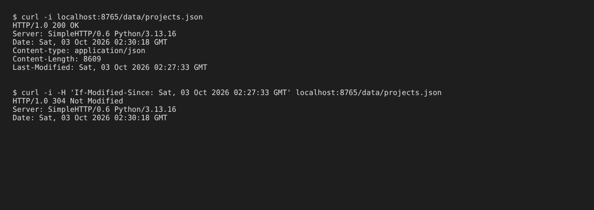

# Portofolio & Portal Layanan: Decoupled Multi-Tier dengan Dynamic CSR

Refactoring tugas Minggu 3 menjadi aplikasi web kontemporer: seluruh konten dimuat asinkron dari penyedia data JSON, bukan lagi ditulis statis di `index.html`.

## Identitas Akademik
- **Nama:** Fredrick Laurensius Aritonang
- **NIM:** 12S24001
- **Program Studi:** S1 Sistem Informasi
- **Mata Kuliah:** Pemrograman dan Pengujian Web (12S3101)
- **Dosen Pengampu:** Chandro Pardede, S.Kom., M.Sc.
- **Live Demo (GitHub Pages):** https://FredrickAritonang.github.io/smartstore-ai-copilot/

## Struktur Direktori
```
.
├── index.html              # Shell HTML5 + Bootstrap 5.3, tanpa kartu hardcoded
├── css/custom-style.css    # Tema, skeleton loading, state komponen
├── data/
│   ├── profile.json        # Biodata, keahlian, alur kerja, sertifikat
│   ├── projects.json       # 4 proyek: metrics, tags, image, link
│   └── services.json       # 3 paket layanan (fitur, tarif) + daftar topik mata kuliah
├── js/
│   ├── api-service.js      # Data Access Layer: fetch, timeout, error handling, POST
│   └── app.js              # Presentation Layer: render DOM, event, state lokal
├── assets/img/             # Foto profil dan sertifikat
└── docs/screenshots/       # Bukti DevTools (lihat bagian 6)
```

## 1. Pemodelan Arsitektur Web (C4 Container Model)



Keterangan: kotak biru = container milik sistem, biru tua = aktor, abu-abu = sistem eksternal, silinder = penyimpanan data.

### Alur permintaan data (CSR)


### Narasi Separation of Concerns
Setiap tier hanya mengurus satu tanggung jawab. **Presentation Tier** (`index.html`, `custom-style.css`, `app.js`) hanya memutuskan bagaimana data ditampilkan: merakit DOM, menangani klik, filter, modal, dan validasi form. **Application/API Logic Tier** (`api-service.js`) menjadi satu-satunya pintu keluar jaringan: ia menyusun URL, menambahkan timeout, menerjemahkan kegagalan jaringan menjadi pesan yang dipahami pengguna, dan membungkus POST dalam kontrak JSON. **Data Storage Tier** (`data/*.json`) berisi isi konten tanpa satu pun logika tampilan. Hasilnya, mengganti sumber data menjadi API sungguhan cukup mengubah `ApiService`, dan mengubah isi portofolio cukup menyunting JSON tanpa menyentuh HTML. Pemisahan ini juga membuat tiap lapisan dapat diuji sendiri.

### Perbandingan paradigma (ringkas)
| Aspek | Monolith SSR | CSR (proyek ini) | Jamstack |
|---|---|---|---|
| Perakitan DOM | Server, tiap request | Browser, lewat JS | Build-time, lalu hydrate via API |
| Beban server | Tinggi | Sangat rendah | Minimal (CDN) |
| TTFB | Menengah-lambat | Cepat (shell kecil) | Sangat cepat (cache CDN) |
| SEO / konten awal | Baik | Perlu JS agar konten muncul | Baik |
| Hosting | Runtime aktif | Static host | Static host + serverless |

Proyek ini memilih CSR di atas static hosting karena datanya kecil, jarang berubah, dan tidak memerlukan server aplikasi. Konsekuensinya: konten awal baru terlihat setelah JS selesai mengambil JSON, itulah alasan skeleton loading dipakai. Pada skala besar, Microservices memisahkan domain bisnis menjadi layanan independen, dengan biaya operasional yang jauh lebih tinggi; untuk portofolio ini hal itu berlebihan.

## 2. Tabel Komparasi Sebelum vs Sesudah Refactoring
| Aspek | Sebelum (Minggu 3) | Sesudah (Minggu 4) |
|---|---|---|
| Sumber konten | Hardcoded di `index.html` | `data/*.json`, dimuat via `fetch()` |
| Rendering | Statis, dirakit saat menulis HTML | Dinamis di browser (CSR), `async/await` |
| Modal proyek | Satu modal per proyek | **1 modal universal**, isi diinjeksi berdasarkan `data-id` |
| UI state | Tidak ada | Loading (skeleton), Success, Empty, Error + "Coba lagi" |
| Filter | Tidak ada | Kategori + pencarian teks, instan tanpa fetch ulang |
| Form | Submit standar (reload halaman) | `fetch()` HTTP POST JSON, tanpa reload, spinner, toast |
| State sisi klien | Tidak ada | Riwayat pesanan di `localStorage`, badge reaktif (sinkron antar-tab) |
| Katalog layanan | Tidak ada | `services.json` (10 paket) dirender sebagai kartu, memilih paket mengisi form |
| Keamanan | Tidak ada | Tanpa `innerHTML` untuk data, validasi URL, CSP, SRI |
| Caching | Tidak diukur | Cold vs warm load diukur di DevTools (bagian 6) |

## 3. UI States
| State | Pemicu | Tampilan |
|---|---|---|
| Loading | Sebelum `fetch()` selesai | Kartu skeleton dengan animasi shimmer (dimatikan bila `prefers-reduced-motion`) |
| Success | JSON valid dan berisi data | Kartu proyek, paket layanan, sertifikat |
| Empty | Filter/pencarian tanpa hasil, atau JSON kosong | Pesan penjelasan + tombol "Reset filter" |
| Error | HTTP non-2xx, jaringan putus, atau timeout 8 detik | Alert merah dengan penyebab + tombol "Coba lagi" |

Setiap sumber data (profil, proyek, layanan) memiliki state sendiri, sehingga kegagalan satu berkas tidak menjatuhkan seluruh halaman. Untuk demo/screenshot:
- `index.html?delay=2000` memperlihatkan state Loading lebih lama
- `index.html?simulate=projects` memicu state Error (`profile`, `services`, juga didukung; `order` memicu gagal-kirim form)

## 4. Keamanan Sisi Klien
- **Anti DOM-XSS:** semua nilai dari JSON dirender dengan `textContent`/`setAttribute` lewat helper `el()`. Tidak ada `innerHTML` yang berisi data dinamis.
- **Validasi URL:** `safeUrl()` hanya meloloskan `http(s)` atau path relatif, sehingga `javascript:` dan `data:` dari JSON ditolak.
- **Content Security Policy** (meta tag di `index.html`): skrip hanya dari `'self'` dan `cdn.jsdelivr.net`, tanpa `unsafe-inline`; `connect-src` dibatasi ke `'self'` dan endpoint mock; `object-src 'none'`. Karena itu tidak ada atribut `onerror`/`style` inline; fallback gambar memakai listener terdelegasi dan style dipindah ke CSS.
- **SRI:** Bootstrap dari CDN diberi `integrity` sha384.
- **Validasi form:** atribut HTML5 (`required`, `type=email`, `minlength`, `maxlength`) + `checkValidity()`, dan nilai dipotong (`slice`) sebelum dikirim.
- **Catatan:** CSP lewat meta tag tidak mendukung `frame-ancestors`; untuk produksi, kirim CSP sebagai header HTTP.

## 5. Cara Menjalankan Lokal
`fetch()` tidak bekerja dari `file://`. Jalankan lewat server statis, misalnya ekstensi **Live Server** di VS Code atau `python -m http.server 8000`, lalu buka `http://localhost:8000`.

## 6. Analisis Caching & Profil Kinerja (DevTools)

**Metode.** Halaman dimuat dua kali pada Chromium (tab Network/Performance, setara DevTools) lewat server statis lokal (`python -m http.server`): *cold load* pada profil browser baru (cache kosong), lalu *warm load* berupa reload biasa (F5) pada sesi yang sama. Angka diambil dari Resource Timing/Navigation Timing API (`transferSize`: 0 B = dilayani dari cache, ~300 B = revalidasi `304`). Bootstrap dari CDN tidak ikut dihitung karena di luar origin. Cara mengulang pengukuran di DevTools:
1. **Cold load:** centang *Disable cache*, lalu *Hard reload* (Ctrl+Shift+R). Catat TTFB (request `index.html` → *Timing* → *Waiting for server response*), jumlah request, dan total transfer di bilah bawah.
2. **Warm load:** hilangkan centang *Disable cache*, lalu muat ulang biasa (F5).
3. **Cek header:** klik `projects.json` → *Headers* → catat `Status Code`, `Last-Modified`/`ETag`, `Cache-Control`.

Snippet pengukuran (tempel di Console setelah halaman selesai dimuat):
```js
(() => {
  const nav = performance.getEntriesByType('navigation')[0];
  const fcp = performance.getEntriesByName('first-contentful-paint')[0];
  const res = performance.getEntriesByType('resource');
  console.table({
    'TTFB (ms)': Math.round(nav.responseStart - nav.requestStart),
    'FCP (ms)': fcp ? Math.round(fcp.startTime) : 'belum tersedia',
    'DOMContentLoaded (ms)': Math.round(nav.domContentLoadedEventEnd),
    'load (ms)': Math.round(nav.loadEventEnd),
    'Total request': res.length + 1,
    'Transfer (kB)': ((nav.transferSize + res.reduce((a, r) => a + r.transferSize, 0)) / 1024).toFixed(1)
  });
})();
```

### Tabel Cold Load vs Warm Load
| Metrik | Cold Load | Warm Load (reload) |
|---|---|---|
| TTFB `index.html` (ms) | 3.2 | 1.0 |
| FCP (ms) | 460 | 272 |
| Total request | 11 | 11 |
| Data ditransfer (kB) | 1155.53 | 0.29 |
| Waktu `DOMContentLoaded` (ms) | 357 | 276 |
| Waktu `load` (ms) | 364 | 279 |

### Analisis Header Caching
| Berkas | Status cold | Status warm | Transfer cold → warm | Keterangan |
|---|---|---|---|---|
| `index.html` | 200 | **304 Not Modified** | 13.277 B → 300 B | Selalu divalidasi ke server (tanpa `Cache-Control`); hanya header yang dikirim ulang |
| `data/projects.json` | 200 | 200 (cache) | 8.909 B → 0 B | Segar menurut heuristik `Last-Modified`, tanpa permintaan jaringan |
| `js/app.js` | 200 | 200 (cache) | 19.748 B → 0 B | Sama seperti di atas |
| `css/custom-style.css` | 200 | 200 (cache) | 8.240 B → 0 B | Sama seperti di atas |

Bukti `304` pada respons server: lihat `docs/screenshots/status-304.png` (permintaan bersyarat `If-Modified-Since` dijawab `304 Not Modified` tanpa body).

### Analisis
- **(a) 304 Not Modified.** `index.html` menerima `304`: browser mengirim `If-Modified-Since`, server menjawab tanpa body, sehingga transfer turun dari 13.277 B menjadi 300 B (hemat sekitar 97,7%). Total transfer halaman turun dari 1155.53 kB menjadi 0.29 kB.
- **(b) `(disk cache)` vs `304`.** `(disk cache)`/`(memory cache)` berarti browser menganggap salinan masih segar dan **tidak mengirim request sama sekali** (0 B, 0 ms jaringan). `304` berarti request tetap dikirim untuk validasi, tetapi body tidak diunduh ulang. Keduanya menghemat bandwidth; hanya `304` masih membayar satu round-trip.
- **(c) TTFB.** TTFB `index.html` sangat kecil (3.2 ms) karena shell HTML hanya 13 kB dan disajikan statis tanpa komputasi server, inilah keuntungan arsitektur CSR di atas static hosting. Request paling lama di waterfall cold load adalah gambar sertifikat (`sertifikat-nalara.png`, 625 kB) karena ukurannya; itu tidak memblokir render karena memakai `loading="lazy"` dan JSON tiga berkas diunduh paralel (`<link rel="preload">`).
- **Catatan:** pengukuran memakai server lokal; pada GitHub Pages TTFB lebih tinggi (jaringan nyata) dan `Cache-Control: max-age=600` plus `ETag` membuat revalidasi `304` lebih sering muncul. Angka absolut akan berbeda, pola cold vs warm sama.

### Screenshot




## 7. Pengujian Manual
- [x] Halaman memuat profil, 3 sertifikat, 10 proyek, 10 paket layanan dari JSON
- [x] `?delay=2000` menampilkan skeleton; `?simulate=projects` menampilkan alert + "Coba lagi" yang berfungsi
- [x] Filter kategori dan pencarian bekerja; hasil kosong menampilkan Empty State dan "Reset filter" memulihkannya
- [x] Hanya ada satu elemen `.modal` di DOM; tombol detail membuka modal dengan isi berbeda per proyek
- [x] Form kosong tidak terkirim dan menunjukkan pesan validasi; form valid mengirim POST (lihat tab Network, tipe `fetch`, status 201) tanpa reload
- [x] Badge "Riwayat pesanan" bertambah, riwayat tampil di panel, dan bertahan setelah refresh
- [x] Console bersih dari error CSP

## 8. Git & Deployment
```bash
git checkout -b week4-architecture
git add .
git commit -m "feat(week4): decouple architecture to json data providers and async CSR"
git push -u origin week4-architecture
```
GitHub → Settings → Pages → Source: branch `week4-architecture` (atau `main`) → Save.
